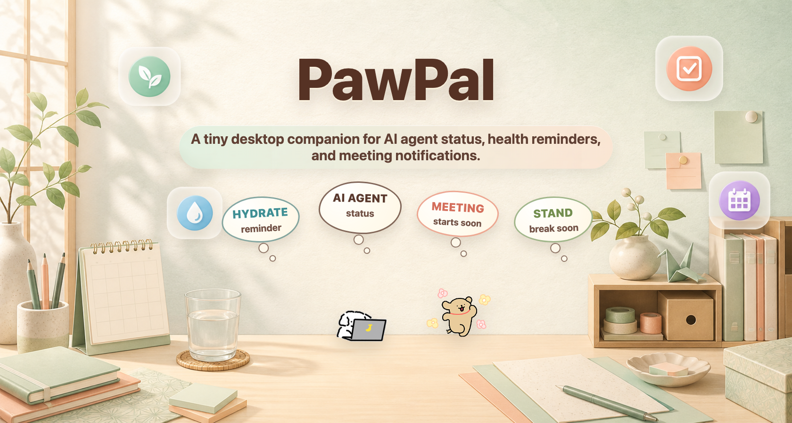

<p align="center">
  
</p>
<p align="center">

<h1 align="center">PawPal</h1>
</p>
<p align="center">
  A tiny desktop dog that helps you pause, hydrate, and stay focused.
</p>

<p align="center">
  
  
  
  
</p>

<p align="center">
  <a href="#english">English</a> · <a href="#中文">中文</a>
</p>

## English

PawPal is a desktop pet app for macOS and Windows. A transparent, always-on-top dog lives on your screen and gently reminds you to take breaks, drink water, and stay focused.

> Design note: I personally love Line Dog, so new updates are designed around the Line Dog style, including new actions, thought bubbles, and text styling.

### Features

- **Break reminders** — timed nudges to get up and move; the dog can run across your screen to get your attention
- **Hydration reminders** — gentle prompts to drink water
- **Focus mode** — detects your active app; if you drift into social media, the dog nudges you back to work
- **Zoom meeting reminders** — read Zoom meetings from an Outlook ICS link, Apple Calendar, or the local Outlook bridge cache; PawPal reminds you and gives you a Join button
- **Zoom screen-share auto-hide** — on macOS, PawPal can hide all pets while Zoom is sharing or paused, then restore them when sharing stops
- **Agent activity** — each pet can watch Codex, Claude Code, Claude Desktop, Cursor, or no agent. PawPal summarizes active chats, file reads, searches, edits, tool calls, and web searches in the same thought-bubble UI, with folder labels on task bubbles when available; double-click a task bubble to jump back to the matching agent when supported
- **Dual Agent Mode** — show two desktop pets at once for dual-screen workflows, with separate pet appearance and agent source per slot; the primary pet keeps break, hydration, and focus reminders
- **Resizable desktop pet** — hover the lower-right corner of the pet window to reveal a resize handle, then drag to make PawPal bigger or smaller
- **Multiple pet styles** — includes Hachi, Xiao Ji Mao, White Line Dog, manual custom GIF uploads, and prompt drafts for generating a full custom pet set
- **Settings dashboard** — tracks today's breaks, waters, focus minutes, and distraction warnings, with runtime diagnostics for agent activity and focus detection
- **Monthly journal** — a journal-style monthly calendar stamps daily water and break goal progress; hover a week to inspect that week's check-ins
- **System controls** — launch-at-login, manual or startup update checks, configurable reminder timing, task bubble retention, blocked apps, and blocked keywords
- **Chinese / English UI**
- **Local-first data** — settings and stats stay on your machine; PawPal only contacts GitHub Releases when you check for updates manually or enable update checks on launch

### Reminder Timing

Break and hydration reminders count active desk time. When the Mac locks or sleeps, PawPal clears the current reminder countdown; after unlock or wake, the countdown starts again from the full interval. This avoids stale reminders firing immediately after you step away, commute, or log back in.

### Monthly Journal

The Settings dashboard includes a monthly journal view for lightweight habit tracking. Each day receives a soft stamp color based on water and break progress: green for meeting the goal, yellow for partial progress, and red for missed or low progress. The side tracker defaults to the current week; hover another week in the month calendar to preview that week's water bottles and dog stamps, then it returns to the current week when you stop hovering.

### Zoom Meeting Reminders

PawPal can remind you about Zoom meetings from an Outlook calendar link, Apple Calendar, or a local Outlook bridge cache. It does not require a Microsoft login inside PawPal.

In Settings -> System, turn on Zoom Meeting Reminders and paste your Outlook ICS URL. To get the link, **open Outlook on the web, not the Outlook desktop app**. Then go to Settings -> Calendar -> Shared calendars -> Publish a calendar, choose the calendar, publish with view details, and copy the ICS link.

If you cannot see Shared calendars or Publish calendar, your workplace probably disabled calendar publishing in Microsoft 365. In that case the ICS setup is not available for that account, and PawPal would need a different calendar integration path. Keep any ICS link private because anyone with it can read the published calendar details.

On macOS, you can also enable Read Meetings from Apple Calendar. The first read asks for Automation permission so PawPal can inspect Calendar.app events.

### Zoom Screen-Share Auto-Hide

On macOS, enable Auto-Hide During Zoom Share in Settings -> System to hide the desktop pets while Zoom is sharing or paused. PawPal watches Zoom's on-screen share surfaces instead of reading meeting text, so it needs Accessibility permission and restores the pets after sharing stops.

### What's New

- Monthly journal adds journal-style water and break stamps, with weekly hover details
- Zoom meeting reminders can read Outlook ICS, Apple Calendar, or the local Outlook bridge cache and show a Join button
- Zoom screen-share auto-hide hides pets during Zoom sharing and restores them afterward
- Dual Agent Mode adds a second desktop pet for agent-status workflows
- Agent activity now supports Codex, Claude Code, Claude Desktop, and Cursor, with chat jump-back where supported
- Agent task bubbles can show the workspace folder for Codex, Claude, and Cursor sessions when available
- Agent bubbles now show current chat context and distinguish sub-agent wait/return states
- Health reminders keep priority over temporary Zoom or status bubbles, so hydration and break prompts stay visible
- Apple Calendar failures no longer reuse stale Zoom meeting data after events are removed
- Custom pet tools now support prompt drafts, GIF validation, and saved custom pet bundles
- Multiple active task bubbles can be expanded and browsed with controls or the mouse wheel
- Hachi is now available as a built-in pet appearance
- Release builds now include macOS installers and a Windows `.exe` installer

### Install

Download the latest installer from [Releases](../../releases):

| File | Platform |
|------|----------|
| `PawPal-0.3.2-effy.1-arm64.dmg` | macOS Apple Silicon |
| `PawPal-0.3.2-effy.1.dmg` | macOS Intel / universal build |
| `PawPal-0.3.2-effy.1-setup-x64.exe` | Windows 64-bit |

> **macOS**: On first launch, macOS may say the developer cannot be verified. Allow the app in System Settings -> Privacy & Security. Focus distraction detection also requires Accessibility permission.
>
> If you share a locally built `.dmg` without Apple Developer ID signing and notarization, another Mac may block launch. After dragging PawPal to `/Applications`, run:
>
> ```bash
> xattr -dr com.apple.quarantine /Applications/PawPal.app
> open /Applications/PawPal.app
> ```
>
> To make a `.dmg` that opens cleanly for other people, sign it with an Apple Developer ID certificate and submit it for Apple notarization.
>
> **Windows**: download the `.exe` installer from Releases. Distraction detection is not supported yet; the rest of the app works normally. Unsigned Windows builds may show a SmartScreen warning.

### Run From Source

Source builds require Node.js 20+ and pnpm 9. Corepack is recommended:

```bash
corepack enable
git clone https://github.com/effy46/PawPal.git
cd PawPal
pnpm install
pnpm dev
```

If `corepack enable` does not have permission to install shims, install pnpm 9 another way and verify that `pnpm --version` works.

### Install From Source

After cloning the repo, use these steps to install PawPal as a desktop app instead of running the dev server.

**macOS**

```bash
corepack enable
pnpm install
pnpm dist:mac
open dist/PawPal-*.dmg
```

Open the `.dmg`, then drag `PawPal.app` into `/Applications`. If macOS blocks a local unsigned build:

```bash
xattr -dr com.apple.quarantine /Applications/PawPal.app
open /Applications/PawPal.app
```

**Windows**

```bash
corepack enable
pnpm install
pnpm dist:win
```

After the build finishes, run the generated `dist/PawPal.Setup.*.exe`. Windows packages are best built on Windows; building them on macOS may require Wine.

### Build

```bash
pnpm test         # run logic tests
pnpm build        # type-check and build
pnpm dist         # build and package macOS + Windows
pnpm dist:mac     # package macOS only
pnpm dist:win     # package Windows only; on macOS this may require Wine
```

Release builds are prepared locally and uploaded to GitHub Releases manually. Build macOS with `pnpm dist:mac`, build Windows with `pnpm dist:win`, then upload the `.dmg`, `.exe`, `.blockmap`, `latest-mac.yml`, `latest.yml`, and demo image together.

### Agent Activity Bridge

PawPal can reflect live coding-agent work directly in the pet UI. Agent source is explicit: a pet can watch Codex, Claude Code, Claude Desktop, Cursor, or no agent. Defaults are White Line Dog for Codex and Xiao Ji Mao for Claude Code. When an agent is active, the pet shows a compact status badge; hover it for a manga-style thought bubble with the current chat summary.

If several chats are active, PawPal groups them behind a count badge that can expand into separate chat cards and be browsed with controls or the mouse wheel. Agent bubbles and chat cards can show the workspace folder, then open the matching Codex chat, raise the running Claude Code terminal window when possible, open the matching Claude Desktop session, or open Cursor. You can adjust how long task bubbles stay visible in Settings -> System with Task Bubble Retention. Break, hydration, and focus reminders still take priority, so health nudges never get buried behind coding status.

Agent chat bubbles can show context usage with a compact top-right ring, giving a quick sense of when a long chat is getting full.

### Dual Agent Mode Design

Dual Agent Mode lets PawPal show two desktop pets at once for dual-screen workflows. Each pet slot has its own pet appearance, agent source, and health-reminder ownership. Defaults are Slot A = White Line Dog + Codex + health reminders on, and Slot B = Xiao Ji Mao + Claude Code + health reminders off.

Agent source is explicit in both single-pet and dual-pet modes, with options for Codex, Claude Code, Claude Desktop, Cursor, or none. When both dual slots are enabled, the two slots must watch different agent sources. Slot B is agent-status-only by default: draggable, task bubbles, and double-click chat jump are enabled where the agent supports it, but break, hydration, focus reminders, settings, and dashboard controls stay with the primary health pet.

### Tech Stack

- Electron + electron-vite
- React 19 + TypeScript
- electron-store for local persistence
- electron-builder for packaging

### Project Structure

```text
src/main/       Main process: windows, tray menus, timers, persistence, focus detection, updates
src/preload/    IPC bridge
src/renderer/   React UI for the pet window and settings window
src/shared/     Shared types, defaults, i18n, and pet appearance definitions
tests/          Logic tests
pet_assets/     Pet animation assets (GIF)
```

### Roadmap

- [ ] Signed and notarized macOS builds, plus Windows code signing
- [ ] Windows parity for focus/distraction detection where the OS allows it
- [ ] Custom pet library polish: import/export, rename, and gallery management
- [ ] Calendar-aware quiet windows for break and hydration reminders
- [ ] Optional sound effects with per-reminder mute controls

### License

Source code is released under the [MIT License](LICENSE). Pet animation assets have separate licensing; see [ASSET_LICENSE.md](ASSET_LICENSE.md).

---

## 中文

PawPal 是一款支持 macOS 和 Windows 的桌面宠物应用。一只透明、始终置顶的小狗会陪在屏幕上，提醒你休息、喝水，并帮助你保持专注。

> 设计说明：因为我本人喜欢线条小狗，所以所有更新都是围绕线条小狗来制作的，包括新动作、思考内容泡泡🫧和文字 style。

### 功能

- **休息提醒** — 到点提醒你起身活动；需要更强提示时，小狗会跑过屏幕吸引注意
- **喝水提醒** — 温和提醒你补充水分
- **专注模式** — 识别当前正在使用的应用；切到社交媒体或其它分心页面时，小狗会提醒你回到工作
- **Zoom 会议提醒** — 可读取 Outlook ICS 链接、Apple 日历或本地 Outlook bridge cache，并在 Zoom 会议开始前提醒你、提供加入按钮
- **Zoom 屏幕共享自动隐藏** — macOS 上可以在 Zoom 正在共享或暂停共享屏幕时隐藏所有桌宠，结束后自动恢复
- **Agent 状态** — 每只宠物都可以选择跟踪 Codex、Claude Code、Claude Desktop、Cursor，或只当普通桌宠；任务泡泡会显示当前聊天、读文件、搜索、改文件、调用工具和网页搜索，并在可用时标出对应 folder，支持时可双击跳回对应 Agent
- **双桌宠 Agent 模式** — 可同时显示两只桌宠，适合双屏使用；每只宠物都能单独设置外观和跟踪对象，主要宠物继续负责休息、喝水和专注提醒
- **桌宠大小调整** — 鼠标移到宠物窗口右下角会出现调整手柄，拖动即可放大或缩小 PawPal
- **多种宠物外观** — 包含白色线条小狗、小鸡毛、金毛幼犬、小八，也支持手动上传自定义 GIF 和创建整套自定义宠物提示词草稿
- **设置仪表盘** — 记录当天休息、喝水、专注分钟和分心提醒次数，并提供 Agent 状态与专注检测诊断
- **月度手帐统计** — 用月历和盖章记录每天的喝水、休息目标完成情况；悬停某一周可查看那一周的打卡明细
- **系统控制** — 支持开机自启、启动时或手动检查更新、提醒时间配置、任务泡泡保留时间、分心应用和关键词配置
- **中文 / English 界面**
- **本地优先** — 设置和统计数据保存在本机；只有手动检查更新或开启启动时检查更新时，PawPal 才会访问 GitHub Releases

### 提醒计时

休息和喝水提醒按实际桌面使用时间计时。Mac 锁屏或进入睡眠时，PawPal 会清空当前提醒倒计时；解锁或唤醒后，倒计时会从完整间隔重新开始。这样你短暂离开、合盖通勤或重新登录后，不会立刻收到已经过期的提醒。

### 月度手帐统计

设置页里新增了月度手帐视图，用更轻量的方式记录习惯。每天会根据喝水和休息完成度显示柔和的盖章颜色：绿色表示达成目标，黄色表示部分完成，红色表示没有完成或完成度较低。右侧周记录默认显示当前周；鼠标悬停到月历里的其它周时，会临时切换到那一周的水瓶和小狗盖章，移开后自动回到当前周。

### Zoom 会议提醒设置

PawPal 可以通过 Outlook 的 ICS 日历链接、Apple 日历或本地 Outlook bridge cache 提醒 Zoom 会议，不需要在 PawPal 里登录 Microsoft。

打开“设置 -> 系统”，开启“Zoom 会议提醒”，然后粘贴 Outlook ICS 链接。获取方式：**打开 Outlook 网页版，不是 Outlook 桌面 App**。然后进入“设置 -> 日历 -> 共享日历 -> 发布日历”，选择要发布的日历，使用可查看详情的权限发布，再复制 ICS 链接。

如果看不到“共享日历”或“发布日历”，通常是公司在 Microsoft 365 后台关闭了日历发布。这种情况下，这个账号就不能用 ICS 方式接入，PawPal 需要换另一种日历集成方式。请不要公开分享 ICS 链接，因为拿到链接的人可以读取已发布的日历内容。

macOS 上也可以开启“从 Apple 日历读取会议”。首次读取时，系统会请求自动化权限，让 PawPal 可以读取“日历”App 里的会议。

### Zoom 屏幕共享自动隐藏

macOS 上可以在“设置 -> 系统”开启“Zoom 共享时自动隐藏”。PawPal 会在 Zoom 正在共享或暂停共享屏幕时隐藏所有桌宠，结束共享后自动恢复。这个功能读取 Zoom 的屏幕共享窗口状态，需要辅助功能权限。

### 本次更新

- 新增月度手帐统计，用水瓶和小狗盖章记录喝水、休息目标完成情况，并支持悬停查看每周明细
- 新增 Zoom 会议提醒，可读取 Outlook ICS、Apple 日历或本地 Outlook bridge cache，并显示加入按钮
- 新增 Zoom 屏幕共享自动隐藏，共享时隐藏桌宠，结束后恢复
- 新增双桌宠 Agent 模式，可用第二只桌宠查看 Agent 状态
- Agent 状态支持 Codex、Claude Code、Claude Desktop 和 Cursor，支持时可跳回对应聊天
- Agent 任务泡泡可在可用时显示 Codex、Claude 和 Cursor session 所在的 workspace folder
- Agent 泡泡现在会显示当前聊天上下文，并区分等待子 agent 和子 agent 返回的状态
- 喝水和休息提醒会优先于临时 Zoom 或状态泡泡，避免健康提醒被盖住
- Apple Calendar 读取失败后不再复用旧的 Zoom 会议数据，避免提醒已经删除的会议
- 自定义宠物工具支持提示词草稿、GIF 检查和保存完整宠物包
- 多个活跃任务泡泡可展开，并用按钮或鼠标滚轮浏览
- 小八已加入内置宠物外观
- Release 已包含 macOS 安装包和 Windows `.exe` 安装包

### 安装

从 [Releases](../../releases) 下载对应平台的安装包：

| 文件 | 适用设备 |
|------|----------|
| `PawPal-0.3.2-effy.1-arm64.dmg` | macOS Apple Silicon |
| `PawPal-0.3.2-effy.1.dmg` | macOS Intel / universal build |
| `PawPal-0.3.2-effy.1-setup-x64.exe` | Windows 64 位 |

> **macOS**：首次打开时，系统可能提示“无法验证开发者”。请到“系统设置 -> 隐私与安全性”中允许打开。专注模式的分心检测还需要授予“辅助功能”权限。
>
> 如果安装包是本地构建并直接分享的版本，没有 Apple Developer ID 签名和 Apple 公证，另一台 Mac 可能会阻止启动。把 `PawPal.app` 拖到 `/Applications` 后，可以运行：
>
> ```bash
> xattr -dr com.apple.quarantine /Applications/PawPal.app
> open /Applications/PawPal.app
> ```
>
> 如果希望分享出去的 `.dmg` 可以直接双击打开，需要使用 Apple Developer ID 证书签名，并提交 Apple 公证。
>
> **Windows**：从 Releases 下载 `.exe` 安装包即可。分心检测目前仍不支持 Windows，其余功能可正常使用。未签名的 Windows 构建可能会触发 SmartScreen 提示。

### 从源码运行

源码运行需要 Node.js 20+ 和 pnpm 9。推荐使用 Corepack：

```bash
corepack enable
git clone https://github.com/effy46/PawPal.git
cd PawPal
pnpm install
pnpm dev
```

如果 `corepack enable` 没有权限安装命令入口，可以用其他方式安装 pnpm 9，并确认 `pnpm --version` 可以正常运行。

### 从源码安装为桌面应用

如果你从源码克隆项目，并希望把 PawPal 安装到系统中作为桌面应用，而不是只在开发模式下运行，可以按下面步骤操作。

**macOS**

```bash
corepack enable
pnpm install
pnpm dist:mac
open dist/PawPal-*.dmg
```

打开 `.dmg` 后，把 `PawPal.app` 拖到 `/Applications`。如果 macOS 阻止打开本地未签名的构建版本：

```bash
xattr -dr com.apple.quarantine /Applications/PawPal.app
open /Applications/PawPal.app
```

**Windows**

```bash
corepack enable
pnpm install
pnpm dist:win
```

构建完成后，运行生成的 `dist/PawPal.Setup.*.exe` 安装。Windows 安装包建议在 Windows 机器上构建；如果在 macOS 上构建，可能需要额外安装 Wine。

### 构建

```bash
pnpm test         # 运行逻辑测试
pnpm build        # 类型检查并构建
pnpm dist         # 构建并打包 macOS + Windows
pnpm dist:mac     # 仅打包 macOS
pnpm dist:win     # 仅打包 Windows；在 macOS 上可能需要 Wine
```

正式发布包在本地构建后手动上传到 GitHub Releases。用 `pnpm dist:mac` 构建 macOS，用 `pnpm dist:win` 构建 Windows，然后一起上传 `.dmg`、`.exe`、`.blockmap`、`latest-mac.yml`、`latest.yml` 和 demo image。

### Agent 状态联动

PawPal 可以把 coding agent 的工作状态直接显示在桌宠 UI 里。每只宠物都可以选择跟踪 Codex、Claude Code、Claude Desktop、Cursor，或不跟踪 Agent。默认配置是白色线条小狗跟踪 Codex，小鸡毛跟踪 Claude Code。Agent 活跃时，桌宠会显示一个简洁的状态徽标；鼠标悬停可用漫画风思考泡泡查看当前聊天摘要。

如果多个聊天同时活跃，PawPal 会先显示数量徽标，点击后展开为独立聊天卡片，并可用按钮或鼠标滚轮浏览。Agent 泡泡和聊天卡片会在可用时显示对应 workspace folder；双击后可以跳回对应的 Codex 对话，Claude Code 会优先唤起正在运行的终端窗口，Claude Desktop 会打开对应桌面会话，Cursor 会打开 Cursor 应用。你也可以在“设置 -> 系统”里调整任务泡泡保留时间。休息、喝水和专注提醒仍然优先显示，不会被 Agent 状态挡住。

Agent 聊天气泡可以用右上角的小圆环显示 context 使用情况，方便快速判断长对话是否快满。

### 双桌宠 Agent 模式

双桌宠 Agent 模式可以同时显示两只桌宠，适合双屏使用。每只宠物都可以单独选择外观和跟踪对象。默认配置是：白色线条小狗跟踪 Codex，并负责休息、喝水和专注提醒；小鸡毛跟踪 Claude Code，只显示 Agent 状态。

单桌宠和双桌宠模式都会使用同一套跟踪对象设置，可选 Codex、Claude Code、Claude Desktop、Cursor 或不跟踪 Agent。双桌宠模式开启时，两只宠物不能跟踪同一个 Agent，避免重复显示。第二只宠物默认只负责 Agent 状态：可以拖动、显示任务泡泡、双击跳转聊天；休息、喝水、专注提醒、设置和仪表盘仍由主要宠物负责。

### 技术栈

- Electron + electron-vite
- React 19 + TypeScript
- electron-store 用于本地持久化
- electron-builder 用于打包分发

### 项目结构

```text
src/main/       主进程：窗口管理、托盘菜单、定时器、持久化、专注检测、更新检查
src/preload/    IPC 桥接层
src/renderer/   React UI：宠物窗口和设置窗口
src/shared/     共享类型、默认配置、i18n、宠物外观定义
tests/          逻辑测试
pet_assets/     宠物动画素材（GIF）
```

### 开发路线

- [ ] macOS 签名与公证，以及 Windows 代码签名
- [ ] Windows 端专注 / 分心检测能力补齐（在系统权限允许的范围内）
- [ ] 自定义宠物库优化：导入导出、重命名和图库管理
- [ ] 基于日历的休息 / 喝水提醒静音时段
- [ ] 可选声音效果，并支持按提醒类型静音

### 许可

源代码基于 [MIT License](LICENSE) 发布。宠物动画素材有单独的授权说明，详见 [ASSET_LICENSE.md](ASSET_LICENSE.md)。
